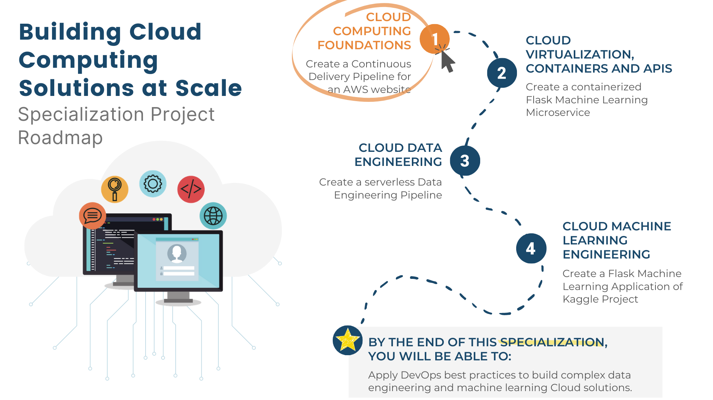

# Introduction
This directory contains different resources available in the Coursera specialization [**Building Cloud Computing Solutions at Scale Specialization**](https://www.coursera.org/specializations/building-cloud-computing-solutions-at-scale)

The progress of the project is tracked using this [**trello board**](https://trello.com/b/S0ZbpfoF/duke-cloud-computing-project).

## Course 1 : [Cloud Computing Foundations](https://www.coursera.org/learn/cloud-computing-foundations-duke?specialization=building-cloud-computing-solutions-at-scale)

## Course 2 : [Cloud Virtualization, Containers and APIs](https://www.coursera.org/learn/cloud-virtualization-containers-api-duke?specialization=building-cloud-computing-solutions-at-scale)

## Course 3 : [Cloud Data Engineering](https://www.coursera.org/learn/cloud-data-engineering-duke?specialization=building-cloud-computing-solutions-at-scale)

## Course 4 : [Cloud Machine Learning Engineering and MLOps](https://www.coursera.org/learn/cloud-machine-learning-engineering-mlops-duke?specialization=building-cloud-computing-solutions-at-scale)

